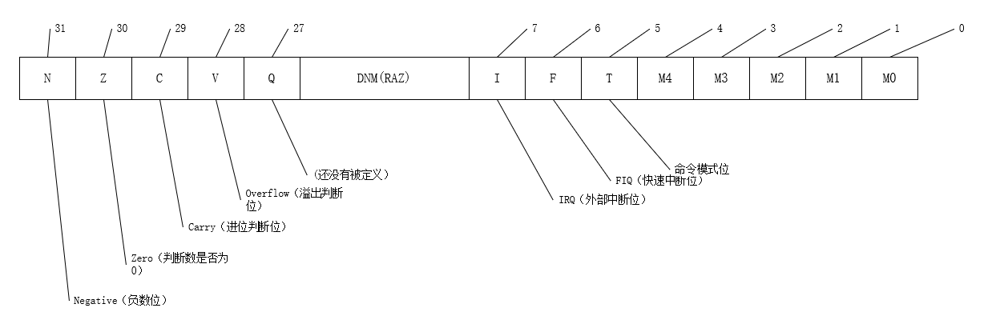

# 第一章 ARM概述及其基本编程模型

## ARM处理模式

+ 非特权模式：
    1. usr（用户模式）：正常程序执行的模式
+ 特权模式：
    1. sys（系统模式）：用于运行特权级的操作系统任务
    2. svc（特权模式）：供操作系统使用的一种保护模式
    3. und（未定义指令中止模式）：用于支持通过软件仿真硬件的协处理器
    4. abt（数据访问中止模式）：用于虚拟储存及存储保护
    5. irq（外部中断模式）：用于通常的中断处理
    6. fiq（快速中断模式）：用于高速数据传输与通信

## ARM寄存器

+ 总共有37个寄存器：31个通用寄存器 + 6个状态寄存器
+ 31个通用寄存器可以分为3类：
    1. 未备份寄存器：R0 ~ R7
    2. 备份寄存器：R8 ~ R14
    3. 程序计数器：R15（PC）
+ 寄存器R13通常称为堆栈指针（SP）：保存栈的地址，使其指向该模式专用的栈地址（也可以写成sp）
+ 寄存器R14通常称为程序连接器寄存器（LR）：存放当前子程序的返回地址，也可以作为通用寄存器
+ 寄存器R15称为程序计数器
+ 程序状态寄存器（CPSR）
    1. 格式（SPSR与此相同）
    2. CPSR中的条件标志位
    >标志位|含义
    >|:--:|:--:|
    >N|本位设置当前命令运算结果的`bit[31]`的值</br>当 **两个补码** 表示的 **有符号整数运算**:</br>N = 1 表示运算的结果为负数</br>N = 0 表示运算结果为整数或零
    >Z|Z = 1 表示运算结果为0</br>Z = 0 表示运算结果不为0
    >C|下面分4种情况讨论C的设置方法：</br>在 **加法指令中（包含比较指令CMN）** ，当结果产生了进位，则 C = 1，表示无符号数运算发生上溢；请他情况下C = 0</br>在 **减法指令中（包含比较指令CMP）** ，当运算发生了借位，则 C = 0，表示无符号运算发生了下溢；请他情况下 C = 1;</br>对于包含移位操作的非加法/减法运算指令，C包含最后一次溢出的位的数值</br>对于其他非加法/减法运算指令，C位的值通常不受影响
    >V|对于加/减法运算指令，当操作数和运算结果为二进制的补码表示的带符号数，V = 1 表示符号位溢出</br>通常其他的指令不影响V位，具体可参考各指令说明
    >当这些符号位对应的数值为0是，字母位小写；数值为1时，字母为大写

## ARM体系的异常中断

+ 在ARM体系中，通常有3种方式程序控制的执行流程：
    1. 在正常程序中，每执行一条thumb指令，程序计数器`+2`；每执行一条ARM指令，程序计数器`+4`。整个程序是按顺序执行
    2. 跳转指令，可以跳转到特定的地址标号处执行，或者特定的子程序处执行
    3. 当异常中断发生时，系统执行完当前指令后，将跳转到相应的异常中断处理程序处执行。中断发生时，要保存异常中断现场

>异常中断种类|中断向量
>|:-------:|:----:|
>复位（特权模式svc）|0x0
>软件中断（特权模式svc）|0x4
>未定义指令|0x0c
>指令预取中止|0x10
>数据访问中止|0x14
>外部中断请求|0x18
>快速中断请求|0x1c

+ ARM处理器对异常中断的响应过程
    1. 保存当前状态、中断屏蔽位及各种条件标志位
    2. 设置当前程序状态寄存器CPSR中的相应位
    3. 将寄存器lr_mode设置返回地址
    4. 将程序计数器（PC）设置成该异常中断的中断向量地址，从而跳转到相应的异常中断处理程序处处理
    5. 伪代码：

        ```armasm
        R14_<exception_mode> = return link
        SPSR_<exception_mode> = CPSR
        CPSR[4:0] = exception mode number
        /*当相应FIO异常中断时，禁止新的FIO中断*/
        if <exception_mode> == Reset or FIO then CPSR[6] = 1;
        /*禁止新的FIO中断*/
        CPSR[7] = 1
        PC = exception vector address
        ```

+ 返回过程：
    1. 恢复被中断的程序的处理器状态，即将SPSR_mode寄存器内容复制到CPSR中
    2. 返回到发生异常中的指令的下一条指令处执行，即把lr_mode寄存器中的内容复制到程序计数器中（PC）

## ARM体系中的存储的系统

+ 大端格式（big-endian）：字数据的高字节存储在低地址中，低字节存储在高地址（高低低高）
+ 小端格式（little-endian）：字数据的高字节存储在高地址，低字节存储在低地址中（高高低低）</br>

