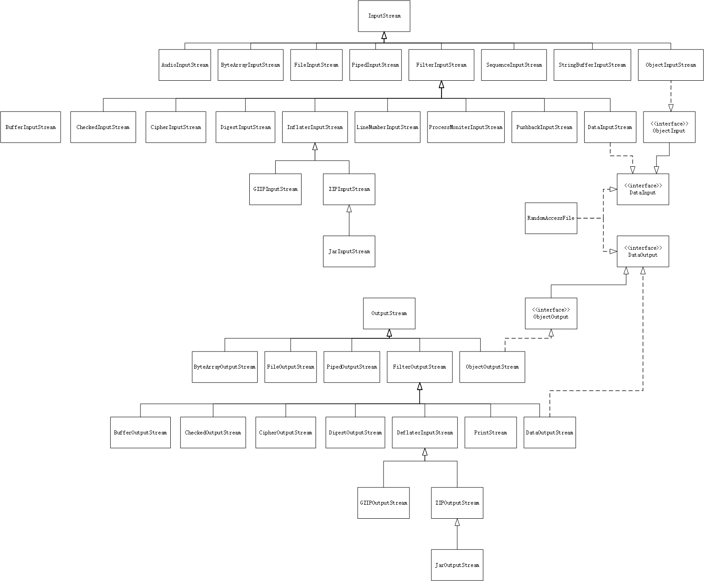
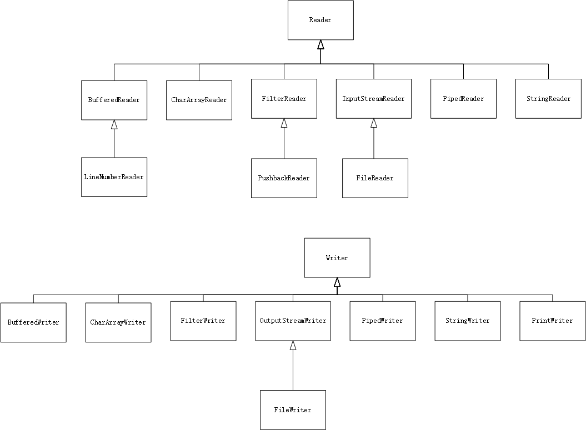
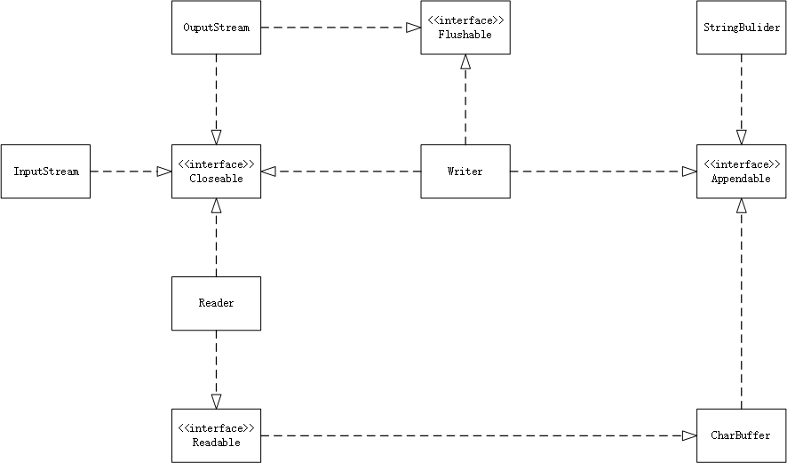

# 第十六章 输入与输出

## 输入/输出流

### 完整流家族

+ 输入流与输出流的层次</br>
    1. `InputStream`和`OutputStream`类, 可以读写单个字节或这是字节数组
    2. `DataInputStream`和`DataOutputStream`类, 可以以二进制格式读写所有基本的Java类型
    3. `ZIPInputStream`和`ZIPOutputStream`类, 可以以常见的ZIP压缩文件格式读写文件
+ Reader和Writer的层次</br>
    1. 用来处理Unicode文本
+ Closable、Flushable、Readable和Appendable接口

### 组合输入输出流过滤器

+ 所有在java.io中的类都将 **相对路径名** 解释为 **以用户工作目录开始**, 可以通过调用`System.getProperty("user.dir")`来获取这个信息

## 文本输入与输出

+ 在存储文本字符串时，需要考虑字符串编码方式，Java内部使用UTF-16编码方式
+ `OutputStreamWriter`类使用选定的字符编码方式，把Unicode码元的输入流转啊混为字节流
+ `InputStreamReader`类包含字节的输入流转换为可以生产Unicode码元的读入器
+ *读入流输入器* 会假定使用主机系统所使用的默认字符编码方式：

    ```java
    Reader in = new InputStreamReader(System.in);
    ```

### 如何写出文本输出

+ `PrintWriter`：文本输出
+ 这个类拥有以文本格式打印字符串和数字的方法
+ 还可以链接到`FileWriter`，如：

    ```java
    PrintWriter out = new PrintWriter(new FileOutputStream("employee.txt"), "UTF-8");
    //等同于：
    PrintWriter out = new PrintWriter("employee.txt", "UTF-8");
    ```

+ 使用`ouot.print()`、`out.println()`和`out.printf()`方法，将数据输出到employee.txt文件中
+ 如果写出器设置为 **自动冲刷模式** ，那么只要println被调用，缓冲区中的所有字符都会被发送到它们的目的地（**打印写出器总是带缓冲区的**）
+ **默认情况** 下，自动冲刷机制是被 **禁用** 的：

    ```java
    PrintWriter out = new PrintWriter(
        new OutputStreamWriter(
            new FileOutputStream("employee.txt"), "UTF-8"
        ),
        true
    );
    ```

    print方法不抛出异常，可以调用`checkError`方法查看输出流是否出错

### 如何读入文本输入

+ 最简单的方式使用`Scanner`类
+ 短小的文本文件可以使用String构造器方法：

    ```java
    String content = new String(Files.readAllBytes(filepath), charset);
    ```

+ 如果想要一行一行地读入可以调用：

    ```java
    List<String> lines = Files.readAllLines(filepath, charset);
    ```

+ 如果文件太大，可以将行惰性处理为一个`Stream<String>`对象：

    ```java
    try (Stream<String> lines = Files.lines(filepath, charset)) {
        ...
    }
    ```

### 字符编码方式

+ `StandardCharsets`类具有类型为`Charset`的静态变量，用于表示每种Java虚拟机都必须支持的字符编码方式：
    1. `StandardCharsets.UTF_8`
    2. `StandardCharsets.UTF_16`
    3. `StandardCharsets.UTF_16BE`
    4. `StandardCharsets.UTF_16LE`
    5. `StandardCharsets.ISO_8859_1`
    6. `StandardCharsets.US_ASCII`
+ 在读写文本的时候，应该使用Charset对象

## 读写二进制数据

### DataInput和DataOutput接口

+ `DataOutput`接口定义了下面用于二进制格式写数组、字符、boolean值和字符串的方法：
    1. `writeInt`：总是将一个整数写出为 **4字节** 的二进制数量值，不管它有多少位
    2. `writeDouble`：总是将一个double值写出为 **8字节** 的二进制数量值
    3. `writeUTF`：使用 **修订版的8位Unicode** 转换格式写出字符串，只在用于写出Java虚拟机的字符串是才使用
    4. `writeChars`：其他场合都应该使用这个方法
    5. `writeByte`、`writeBoolean`、`writeLong`、`writeChar`、`writeFloat`、`writeShort`
+ `DataInput`接口用于读回数据，有与DataOutput接口与之相应的read方法
+ `DataInputStream`类实现了DataInput接口，可以将之与某个字节源相结合，如`FileInputStream`：

    ```java
    DataInputStream in = new DataInputStream(new FileInputStream("employee.dat"));
    ```

+ 相类似的，写出二进制数据，可以使用DataOutput接口的`DataOutputStream`类：

    ```java
    DataOutputStream out = new DataOutputStream(new FileOutputStream("employee.dat"));
    ```

### 随机访问文件

+ `RandomAccessFile`类可以在文件中的 **任何位置** 查找或写入文件
+ 磁盘文件都是随机访问的
+ 构造器第二个参数：
    1. `"r"`：读入访问
    2. `"rw"`：读入/写出访问
+ `seek`方法：
    1. 用途：将文件指针设置到文件中的任意字节位置
    2. 参数：long类型整数
    3. 取值范围：0 ~ 文件按照字节来度量的长度之间
+ `getFilePointer`方法：返回文件指针当前位置
+ 该类同时实现了DataOutput和DataInput接口
+ 设置文件读入位置：

    ```java
    long n = 3;
    in.seek((n - 1) * RECORD_SIZE);
    Employee e = new Employee();
    e.readData(in);
    ```

+ 设置文件写出位置：

    ```java
    in.seek((n - 1) * RECORD_SIZES);
    e.writeData(out);
    ```

+ `length`方法：确定文件中的字节总数
+ 记录总数：字节总数 / 每条记录的大小

    ```java
    long nbtyes = in.length() // length in bytes
    int nrecords = (int) (nbytes / RECORD_SIZE);
    ```

+ 通过使用用户 **自定义** 的方法来读写具有固定尺寸的字符串：
    1. `writeFixedString`：写出从字符串开头开始的指定数量码元（如果码元过少，该方法将用0值来补齐字符串）

        ```java
        public static void writeFixedString(String s, int size, DataOutput out) throws IOException {
            for (int i = 0; i < size; i++) {
                char ch = 0;
                if (i < s.length()) ch = s.charAt(i);
                out.writeChar(ch);
            }
        }
        ```

    2. `readFixedString`：从输入流中读入字符，直至读入size个码元，或直至遇到具有0值的字符值，然后跳过输入字段中剩余的0值：

        ```java
        public static String readFixedString(int size, DataInput in) throws IOException {
            StringBuilder b = new StringBuilder(size);
            int i = 0;
            boolean more = true;
            while (more && i < size) {
                char ch = in.readChar();
                i++;
                if (ch == 0) more = false;
                else b.append(ch);
            }
            in.skipBytes(2 * (size - 1));
            return b.toString();
        }
        ```

    3. 将以上两个方法放到`DataIO`助手类的内部

### ZIP文档

+ 使用`ZipInputStream`读入zip文档
+ `getNextEntry`方法返回一个描述这些项的ZipEntry类型的对象
+ 代码如下：

    ```java
    ZipInputStream zin = new ZipInputStream(new FileInputStream(zipname));
    ZipEntry entry;
    while ((entry = zin.getNextEntry()) ! = null) {
        InputStream in = zin.getInputStream(entry);
        read the contents of in
        zin.closeEntry();
    }
    zin.close();
    ```

+ 使用`ZipOutputStream`写出zip文件，对于希望zip文件中的每一项，都应该创建一个ZipEntry对象，并将文件名传递给ZipEntry的构造器
+ 调用`pubNextEntry`方法来写入新的文件
+ 代码如下：

    ```java
    FileOutputStream font = new FileOutputStream("test.zip");
    ZipOutputStream zout = new ZipOutputStream(font);
    //for all files
    {
        ZipEntry ze = new ZipEntry(filename);
        zout.putNextEntry(ze);
        send data to zout;
        zout.closeEntry();
    }
    zout.close();
    ```

## 对象输入/输出流与序列化

### 保存和加载序列化对象

+ 为了保存对象数据，首先要打开一个`ObjectOutputStream`对象：

    ```java
    ObjectOutputStream out = new ObjectOutputStream(new FileOutputStream("employee.dat"));
    ```

+ 使用`writeObject`方法，保存对象：

    ```java
    Employee harry = new Employee("Harry Hacker", 50000, 1989, 10, 1);
    Employee boss = new Employee("Carl Craker", 80000, 1987, 12,, 15);
    out.writeObject(harry);
    out.writeObject(boss);
    ```

+ 读回对象使用`ObjectIuputStream`的`readObject`方法
+ 如果希望在对象输出流中储存或从对象输入流中回复的所有流都进行修改，则这些类需要实现`Seerialiazble`接口（这是标记接口）
+ 对象被重新加载时，可能占据的是与原来完全不同的内存地址
+ 归纳：
    1. 对象流中输出包含所有对象的类型和数据域
    2. 每个对象都被赋予一个序列号
    3. 相同对象的重复出现将被储存为这个对象的序列号的引用

### 修改默认的序列化机制

+ `transient`关键字，防止某些域被序列化，简单地说，就是被transient关键字修饰的对象，将不会被序列化

### 版本管理

+ 对象输入流拒绝读入具有不同指纹的对象
+ 如果类想要对其早期版本保持兼容看，需要首先获取这个类的早期版的指纹，可以使用jdk中的单机程序serialver来获取这个数字：</br>
`serialver classname`
+ 这个类的所有较新的版本都必须把`serialVersionUID`常量定义为与最初版本的指纹相同：

    ```java
    class Employee implements Sarializable {
        public static final long serialVersionUID = ...;
    }
    ```

+ 如果一个类具有名为serialVersionUID的静态数据成员，就不再需要人工计算其指纹，而只需要直接使用这个值
+ 一旦这个静态数据成员被置于某个类的内部，那么序列化系统就可以读入这个类的对象的不同版本

### 为克隆使用序列化

+ 序列化机制有一种有趣的用法：提供了一种克隆对象的简便途径，只要对应的类是序列化即可
+ 做法为：直接将对象序列化到输入流中，然后将其读回
+ 这样产生的新对象是现有对象的一个深拷贝
+ 使用`ByteArrayOutputStream`将数据保存到字节数组中，而不需要将对象写入到文件中

## 操作文件

### Path

+ Path表示一个目录名序列，其后还可以跟着一个文件名
+ 路径可以是相对路径或是绝对路径
+ 第一部分是根目录，"/"或"C:/"
+ 使用静态的`get`方法接受一个或多个字符串，使用系统默认文件系统的路径分隔符连接
+ 可以从配置文件中读取路径：

    ```java
    String baseDir = props.getProperty("base.dir");
    //May be a string such as /opt/myprog or C:\Program Files\myprog
    Path basePath = Paths.get(baseDir);
    ```

+ 路径不必实际对应着某个实际存在的文件，仅仅是一个抽象的名字序列
+ `resolve()`方法将按照下面规则返回一个路径：`p.resolve(q)`

    1. 如果q是绝对路径，则结果就是q
    2. 否则，根据文件系统的规则，将“p后面跟着q”作为结果

+ resolve的对立面是relativize，调用`p.relativize(r))`将产生路径q，而对q进行解析的结果正是r

### 创建文件和目录

+ `Files.createDirectory(path)`创建新目录，其中，路径中除了最后一个部件外，其他部分必须存在
+ `Files.createDirectoris(path)`创建路劲中的中间目录
+ `Files.createFile(path)`创建空文件，如果文件已经存在，回抛出异常
+ 在指定位置创建临时文件或临时目录：（prefix是前缀，suffix是后缀）
    1. `Path newPath = Files.createTempFile(dir, prefix, suffix)`
    2. `Path newPath = Files.createTempFile(prefix, suffix)`
    3. `Path newPath = Files.createTempDirectory(dir, prefix)`
    4. `Path newPath = Files.createTempDirectory(prefix)`

### 复制、移动和删除文件

+ 复制文件：`Files.copy(originalPath, newPath)`
+ 移动文件：`Files.move(originalPath, newPath)`
+ 如果目标路径已经存在，那么复制或是移动将失败
+ 可以使用`REPLACE_EXISTING`选项，覆盖已有的目标路径
+ 使用`COPY_ATTRIBUTES`选项，复制文件的所有属性
+ 也可以同时使用：

    ```java
    Files.copy(fromPath, toPath, StandardCopyOption.REPLACE_EXISTING, StandardCopyOption.COPY_ATTRIBUTES);
    ```

+ 使用`ATOMIC_MOVE`选项，将移动操作定义为原子性的，这样可以保证要么移动操作成功完成，要么源文件继续保持在原来的位置
+ 将输入流复制到Path中，表示想要将输入流存储到硬盘上：`Files.copy(inputStream, toPath)`
+ 将Path复制到输入流中：`Files.copy(fromPath, outputStream)`
+ 删除文件：`Files.delete(path)`
+ 如果删除的文件不存在，delete方法回抛出异常，此时可以使用下面的方法：

    ```java
    boolean deleted = Files.deleteIfExists(path);
    ```

    该删除方法可以用来删除空目录
+ 用于文件操作的标准选项
    1. StandardOpenOption，与newBufferedWriter, newInputStream, newOutputStream, write一起使用
        >选项|描述
        >|:-|:---|
        >READ|用于读取而打开
        >WRITE|用于写入而打开
        >APPEDN|如果用于写入而打开，那么在文件末尾追加
        >TRUNCATE_EXITSING|如果用于写入而打开，那么删除已有内容
        >CREATE_NEW|创建新文件并且在文件已存在的情况下会创建失败
        >CREATE|自动在文件不存在的情况下创建新的文件
        >DELETE_ON_CLOSE|在文件被关闭时，尽可能地删除该文件
        >SPARSE|给系统一个提示，表示该文件是稀疏的
        >DSYN \ SYN|要求对文件数据\数据和元数据的每次更新都必须同步地写入到存储设备中
    2. StandardCopyOption，与copy, move一起使用
        >选项|描述
        >|:-|:---|
        >ATOMIC_MOVE|原子性地移动文件
        >COPY_ATTRIBUTES|复制文件属性
        >REPLACE_EXISTING|如果文件已存在，则替换它
        >LinkOption|与上面的方法以及exists, isDirectory, isRegulerFile等一起使用
        >NOFOLLOW_LINKS|不要跟踪符号链接
    3. FileVisitOption，与find, walk, walkFileTree一起使用
        >选项|描述
        >|:-|:---|
        >FOLLOW_LINKES|跟踪符号链接

### 获取文件信息

+ 路径的属性：
    1. exist
    2. isHidden
    3. isReadalbe, isWritable, isExecutable
    4. isRegularFile, isDirectory, isSymbolicLink
+ `size`方法返回文件的 **字节数**
+ 所有文件系统都会报告一个基本属性集，它们被封装在`BasicFileAttributes`接口中

### 访问目录中的项

+ 静态`Files.list`方法返回一个可以读取目录各个项的`Stream<Path>`对象，此时目录被惰性读取
+ 因为涉及到系统文件的关闭，所以最好使用try块
+ 调用`File.walk(pathToRoot, depth)`来限制想要访问的文件树的深度

### 使用目录流

+ 使用格式
