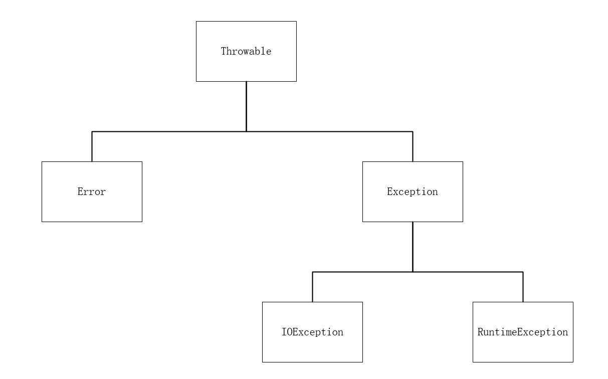

# 第七章 异常、断言和日志

+ 所有异常都是由Throwable继承来的，下一层分解为Error和Exception:

    

+ 应用程序不应该抛出Error类型的对象
+ 由于程序错误导致的异常属于RuntimeException
+ 由于像I/O错误这类问题导致的异常属于其他异常
+ 派生于RuntimeException的异常包含下面几种情况：
    1. 错误的类型转换：`ClassCastException`
    2. 数组访问越界：`ArrayIndexOutOfBoundsException`
    3. 访问null指针：`NullPointerException`
+ 不是派生于RuntimeException包括：
    1. 试图在文件尾部后面读取数据：`EOFException`
    2. 试图打开一个不存在的文件：`FileNotFoundException`
    3. 试图根据给定的字符串查找Class对象，而这个字符串表示的类并不存在：`ClassNotFoundException`
+ 对于一个已经存在的异常类，在这种情况下：
    1. 找到一个合适的异常类
    2. 创建这个类的对象
    3. 将这个对象抛出</br>
    一旦方法抛出异常，这个方法就 **不可能返回调用者**。也就是说，**不必写返回值（也不能写返回值）**
+ 合并catch子句：

    ```java
    try {
        //code that might throw exceptions
    } catch (FileNotFoundException | UnknownHostException e) {
        //emergency action for missing files and unknown hosts
    } catch (IOException e) {
        //emergency action for all other I/O problems
    }
    ```

    只有当捕获的异常类型彼此之间不存在子类关系时才需要这个特性
+ 捕获多个异常时，异常变量隐含着final变量，即 `e` 不能被赋值

## finally子句

+ 当finally子句包含return语句时，这个返回值会覆盖原始的返回值，如：

    ```java
    public static int f(int n) {
        try {
            int t = n * n;
            return n;
        } finally {
            if (n == 2) return 0;
        }
    }
    ```

    返回值为0

+ 带资源的try语句：

    ```java
    try (Resource res = ...) {
    // work with res;
    }
    ```

+ 在try退出时，会自动调用`res.close()`，如：

    ```java
    try (Scanner in = new Scanner(new FileInputStream(“/usr/share/dict/words”)), “UTF-8”) {
        while (in.hasNext())
        System.out.println(in.next());
    }
    ```

### 分析堆栈轨迹元素

+ 堆栈轨迹（stack trace）是一个方法调用过程的列表，它包含了程序执行过程中方法调用的特定位置
+ 一种更灵活的方法是使用`getStackTrace`，它会得到一个`StackTraceElement`对象的一个数组，如：

    ```java
    Throwable t = new Throwable();
    StackTraceElement[] frames = t.getStackTrace();
    for (StackTraceElement frame : frames)
    //analyze frames
    ```

+ 静态的`Thread.getAllStackTrace`方法，可以产生所有线程的堆栈轨迹：

    ```java
    Map<Thread, StackTraceElement[]> map = Thread.getAllStackTrace();
        for (Thread t : map.keySet()) {
        StackTraceElement[] frames = map.get(t);
        analyze frame
    }
    ```

+ 异常机制的技巧
    1. 异常处理不能代替简单的测试
    2. 不要过分细化异常
    3. 利用异常层次结构
    4. 不要压制异常
    5. 在检测错误时，“苛刻”要比放任好
    6. 不要羞于传递异常

## 使用断言

### 断言概念

+ 断言机制允许在测试期间向代码中插入一些检查语句。当代码发布时，这些插入的检测语句会被自动移除
+ `assert`关键字，这个关键词有两种形式：
    1. assert 条件；
    2. assert 条件：表达式；
+ 这两种形式都会对条件进行检测，如果结果为false，则会抛出一个`AssertError`异常。第二 种形式中，表达式将会被传入AssertError的构造器，并转换为一个消息字符串
+ assert的使用方法：
    1. 断言x是一个非负数：assert x >= 0;
    2. 将x的实际值传递给AssertError对象，从而可以在后面显示出来：assert x >= 0 : x;

### 启用和禁用断言功能

+ 在默认情况下，断言是被禁用的。可以在运行程序时用`-enableassertions`或`-ea`选项启用：`java -enableassertions MyApp`
+ 在启用或禁用断言时不必重新编译程序
+ 可以在某个类或整个包中使用断言，如：`java -ea:MyClass -ea:com.mycompany.mylib... MyApp`
+ 禁用断言，可以在运行时用`-disableassertions`或`-da`
+ -ea和-da不能应用在那些没有类加载器的“系统类”上。系统类要使用`-enablesystemassertions`或`-esa`
+ 使用断言的情况：
    1. 断言失败是致命的、不可恢复的错误
    2. 断言检查只用于开发和测试阶段
+ Java中三种处理系统错误的机制：
    1. 抛出异常
    2. 日志
    3. 使用断言

## 记录日志

+ 要生成简单的日志记录，可以使用全局日志记录器，并调用器info方法：`Logger.getGlobal().info(“File->Open menu item selected”);`
+ 在适当的地方（如main开始）调用：`Logger.getGlobal().setLevel(Level.OFF);` 将会取消所有日志

### 高级日志

+ 可以调用`getLogger`方法创建或取记录器:`private static final Logger myLogger = Logger.getLogger(“com.mycompany.myapp”);`
+ 通常有7个日志记录器级别：
    1. SEVERE
    2. WARNING
    3. INFO
    4. CONFIG
    5. FINE
    6. FINER
    7. FINEST
+ 默认情况下，只记录前三个级别
+ 设置级别：`logger.setLevel(Level.FINE);`
+ `Level.ALL`设置所有级别
+ `Level.OFF`关闭所有级别
+ 对于所有方法都有：`logger.waring(message);`（其中waring可以换成其他的级别）
+ 可以使用log方法制定级别：`logger.log(Level.FINE, message);`
+ 可以调用logp方法获得调用类和方法的确切位置，这个方法签名为：`void logp(Level level, String className, String methodName, String message);`
+ 跟踪执行流

### 修改日志管理器配置

+ 默认情况下，配置文件存在于：`jre/lib/logging.properties`
+ 要想使用另一个配置文件，就要将`java.util.logging.config.file`特性设置为配置文件的存储位置，并用下列命令启动应用程序：`java -Djava.util.logging.config.file=configFile MainClass`
+ 修改默认的日志记录级别，编辑配置文件，修改一下命令行：`.level=INFO`

## 调试技巧

1. 打印或记录任意改变的量
2. 在每一个类中放置一个main方法
3. *JUnit*单元测试框架
4. 日志代理
5. 利用Throwable类提供`printStackTrace`方法
6. 堆栈轨迹显示在`System.err`中
7. 将错误信息保存在文件中
8. 采用下面的方式不捕获错误流：`java MyProgram 2 > errors.txt`（其中2为标准错误流System.err)
9. 同时捕获标准输出流System.out和标准错误流System.err：`java MyProgram 1 > errors.txt 2> &1`（其中1为标准输出流）
10. 这些命令运行在bash和windows shell中
11. 调用静态的`thread.setDefaultUncaughtExceptionHandler`方法改变非捕获异常处理器
12. 查看类的加载过程，使用`-verbose`标志启动JVM
13. `-Xlint选`项告诉编译器对一些普遍容易出现的代码问题进行检查
14. 找出 **运行虚拟机的操作系统进程的ID** 。运行`jconsole`程序，使用任务管理器，查看内存消耗、线程使用、类加载的情况
15. 使用`jmap`实用工具获得一个堆的转储，其中显示了每个堆中的对象：</br>
    `java -dump:format=b, file=dumpFileName processID`</br>
    `jhat dumpFileName`
16. 通过浏览器进入`localhost:7000`，运行一个网络应用程序，查看转存对象时对象的内容
17. 使用`-Xprof`标志运行JVM
