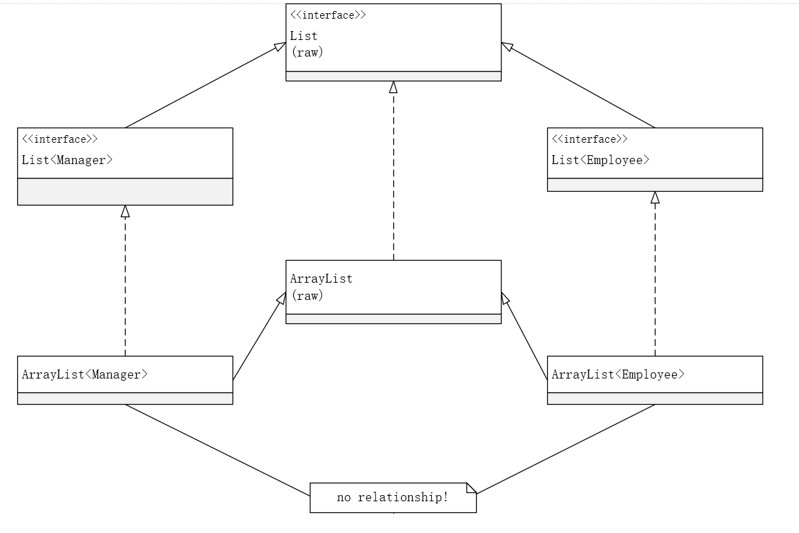

# 第八章 泛型程序设计

+ 泛型类可以看作普通类的工厂
+ 泛型方法可以定义在普通类中，也可以定义在泛型类中
+ 当调用一个泛型方法时，在方法名前的尖括号中放入具体的类型：`String middle = Arraylg.<String>getMiddle("John", "Q", "Public");`</br>
多数情况下，可以省略`<String>`类型参数
+ 限定类型用`&`分隔，逗号用来分隔类型变量
+ 在限定中至多有一个类，如果用一个类作为限定，它必须是限定列表的第一个（对接口没有数量限制）

## 泛型代码和虚拟机

### 类型擦除

+ 无论何时定义一个泛型类型，都自动提供一个相应的 **原始类型** 。原始类型的名字就是删去类型参数后的泛型类型名，如：

    ```java
    public class SomeClass<T> {
        private T field;
        public SomeClass(T field) {
            this.field = field;
        }

        public T getField() { return field; }
        public void setField(T field) { this.field = field; }
    }
    ```

    擦除（erased）类型变量后，替换为限定类型：

    ```java
    public class SomeClass<Object> {
        private Object field;
        public SomeClass(Object field) {
            this.field = field;
        }

        public Object getField() { return field; }
        public void setField(Object field) { this.field = field; }
    }
    ```

    因为T是一个无限定的变量，所以直接用Object替换（称为`SomeClass<T>`的原始类型）
+ 假定声明了一个不同的类型：

    ```java
    public class Interval<T extends Comparable & Serializable> implements Serializable {
        private T lower;
        private T upper;

        public Interval(T first, T second) {
            if (first.compareTo(second) <= 0) {
                lower = first; upper = second;
            }
            else {
                lower = second; upper = first;
            }
        }
    }
    ```

    原始类型的Interval如下：

    ```java
    public class Interval implements Serializable {
        private Comparable lower;
        private Comparable upper;

        public Interval(Comparable first, Comparable second) {...}
    }
    ```

    此时类型擦除后，会使用 **限定列表的第一个类（或接口）** 替换

### 翻译泛型表达式

+ 当程序调用泛型方法时，如果擦除返回类型，编译器插入强制类型转换。如：

    ```java
    Pair<Employee> buddies = ...;
    Employee buddy = buddies.getFirst();
    ```

    擦除getFirst的返回类型后返回Object类型，编译器自动插入Employee的强制类型转换

+ 有关Java泛型转换的事实：
    1. 虚拟机中没有泛型，只有普通的类和方法
    2. 所有的类型参数都用它们的限定类型替换
    3. 桥方法被合成来保持多态
    4. 为了保持类型安全性，必要时插入强制类型转换

### 调用遗留代码

+ 设计Java泛型类型时，主要目标是允许泛型代码和遗留代码之间能够相互操作

## 约束与局限性

+ 不能用基本类型实例化参数类型
+ 运行时类型查询只适用于原始类型：虚拟机中的对象总有一个特定的非泛型类型，因此，所有的类型查询只产生原始类型
+ 不能创建参数化类型的数组
    1. 需要说明的是，只是不允许创建这些数组，而声明类型变量`Pair<String>[]`的变量仍是合法的，不过不能用`new Pair<String>[10]`初始化这个变量
    2. 如果要收集参数化类型对象，只有一种安全而有效的方法：使用`ArrayList:ArrayList<Pair<String>>`
+ Varargs警告</br>
    1. 可以使用两种方法来抑制警告
       1. @SupperssWarmings("unchecked")
       2. @SafeVarargs
+ 不能实例化类型变量
+ 不能构造泛型数组
+ 泛型类的静态上下文中类型变量无效
+ 不能抛出或捕获泛型类的实例
    1. catch子句中不能使用类型变量。例如，一下方法将不能编译：

        ```java
        public static <T extends Throwable> void doWork(Class<T> t) {
            try {
                // do work
            } catch (T e) {
                Logger.global.info(...);
            }
        }
        ```

    2. 在异常规范中使用类型变量时允许的。以下方法是合法的：

        ```java
        public static <T extends Throwable> void doWork(T t) throw T { // OK
            try {
                // do work
            } catch (Throwable realCase) {
                t.initCause(realCase);
                throw t;
            }
        }
        ```

+ 可以消除对受查异常的检查
+ 注意擦除后的冲突

## 泛型类型的继承规则

+ 无论`S`与`T`有什么关系，通常，`Pair<S>`与`Pair<T>`没什么关系（但是如果`S`可转化为`T`，那么`S[]`可以转化为`T[]`）
+ 泛型列表类型中子类型间的联系</br>


## 通配符类型
