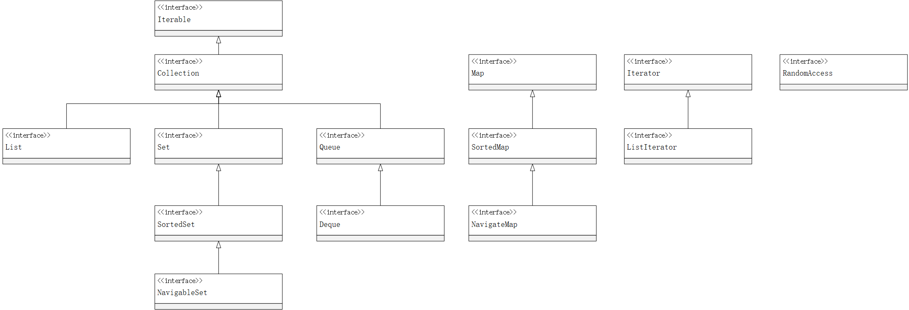
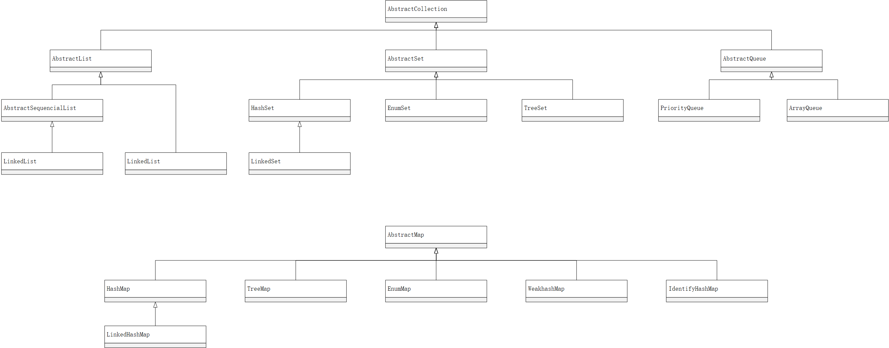

# 第九章 集合

+ 在Java库中，集合类的基本接口是Collection接口。这个接口有两个基本方法：
+ 标准类库中的任何集合都可以使用“`for each`”循环
+ 在Java8中，也可以不用写循环，调用`forEachRemaining`方法并提供一个lambda表达式（它会处理一个元素）。将对迭代器的每一个元素调用一个lambda表达式，直到再没有元素为止 `iterator.forEachRemaining(element -> do something with element);`

## Java集合框架

### 迭代器

+ Iterator接口包含了4个方法：

    ```java
    public interface Iterator<E> {
        E next();
        boolean hasNext();
        void remove();
        default void forEachRemaining(Consumer<? super E> action);
    }
    ```

+ 迭代器查找元素的唯一方法是调用next遍历
+ 可以将`Iterator.next`与`InputStream.read`看作为等效的
+ next方法和remove方法的调用具有互相依赖性。如果在调用remove之前没有调用next将是不合理的。如果这样做，将会抛出一个`IllegalStateException`异常
+ 如果想要删除两个相邻的元素需要先调用next越过将还要删除的元素。

    ```java
    it.remove();
    it.next();
    it.remove();
    ```

### 集合框架中的接口

+ 集合框架中的接口

+ 为了避免对链表完成随机访问操作，Java SE 1.4引入了一个标记接口`RandomAccess`。这个接口不包含任何方法，不过可以用它来测试一个特定的集合是否支持高效的随机访问：

    ```java
    if (c instanceof RandomAccess) {
        use random access algorithm
    }
    else {
        use sequential access algorithm
    }
    ```

+ Set接口等同于Collection接口，但是Set的`add`方法不允许增加重复元素

## 具体的集合

+ 除了以Map结尾的类之外，其他类都实现了Collection接口，以Map结尾的类实现了Map接口
+ 集合框架中的类

+ LinkedList是一个双向链表
+ add方法只依赖于迭代器的位置，而remove方法依赖于迭代器的状态
+ 如果迭代器发现它的集合被另一个迭代器修改了，或者是该集合自身的方法修改，就会抛出一个`ConcurrentModificationException`异常。如：

    ```java
    List<String> list = ...;
    ListIterator<String> iter1 = list.listIterator();
    ListIterator<string> iter2 = list.listIterator();
    iter1.next();
    iter1.remove();
    iter2.next(); // throws ConcurrentModificationException
    ```

+ 
