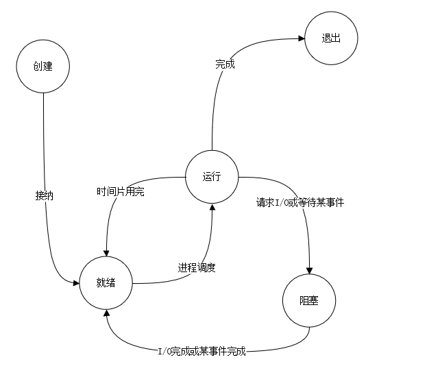
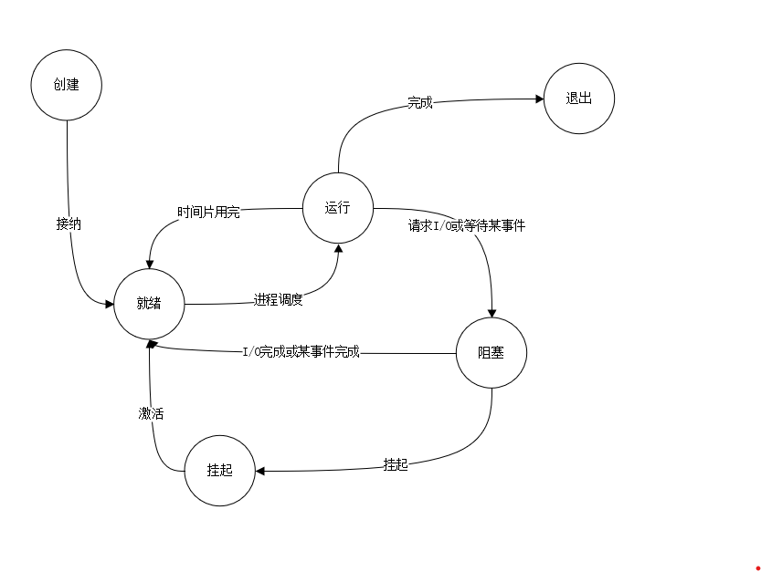
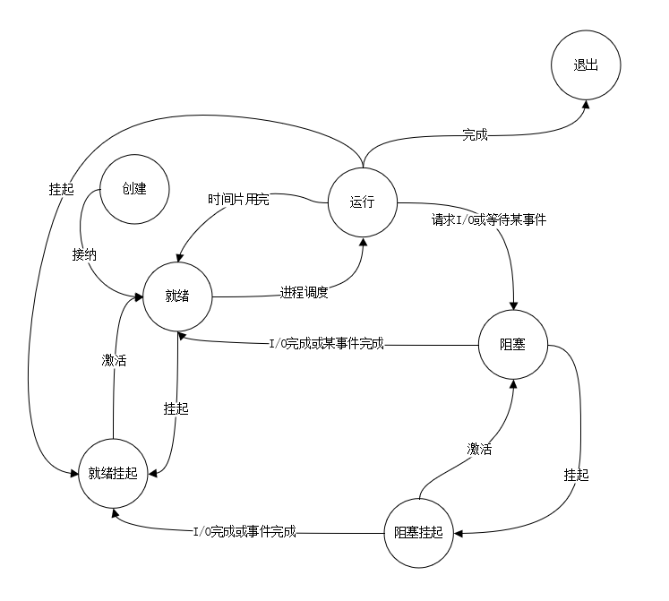

# 第二章 进程与线程

## 进程的引入

### 进程的顺序执行

+ 特点：
    1. 顺序性：处理机的操作严格按照规定顺序执行
    2. 封闭性：程序执行时，独占系统资源
    3. 可再现性：当初始条件相同时，无论执行多少次，结果都相同

### 程序的并发执行

+ 特点：
    1. 间断性：程序在并发执行时，形成相互制约的关系
    2. 失去封闭性：系统中的资源供多个程序享用，导致程序的运行失去了封闭性
    3. 失去可再现性

### 程序并发执行的条件：Bernstein条件

+ 依赖关系
+ 前驱图
+ Bernstein条件：
    1. 读集：R{Pi} = {a1, a2,..., am} 程序Pi执行期间参考的变量集合
    2. 写集：W{Pi} = {b1, b2,...,bm} 程序Pi执行期间改变的变量集合
    3. 若( R{P1} $\bigcap$ W{P2} ) $\bigcup$ ( R(P2) $\bigcap$ W{P1} ) $\bigcup$ ( W{P1} $\bigcap$ W{P2} ) = $\emptyset$
+ 可并发执行的程序在一个数据集合上的 **执行过程**
+ 进程与程序的关系：

>进程 | 程序
>|:-:|:-:|
>动态的|静态的
>并发的|顺序的
>暂时的|永久的
>数据结构 = 程序 + 数据 + PCB|
>独立执行|不是
>程序与进程不是一一对应的

## 进程的状态及其组成 **（很重要）**

+ 进程的状态转换图 

+ 单挂起的进程的状态转化图 

+ 双挂起的进程的状态转化图 

### 进程控制块PCB

+ PCB的作用：
    1. PCB是是进程实体的一部份，是OS中最重要的数据结构
    2. PCB的作用：使一个在多道程序换进下不能独立运行的程序成为一个能独立运行的基本单位，是一个能与其他进程并发执行的进程
+ PCB中的内容
    1. 进程描述信息：
        1. 进程名
        2. 进程标识符
        3. 用户名
    2. 处理机状态信息：
        1. 通用寄存器
        2. 指令寄存器
        3. 程序状态字寄存器
        4. 栈指针
    3. 进程调度信息：
        1. 进程的状态
        2. 进程的优先级
        3. 运行统计信息
        4. 进程阻塞的原因
    4. 进程控制和资源占用信息
        1. 程序入口地址
        2. 程序的外存地址
        3. 进程同步及通信机制
        4. 资源占用信息
        5. 链接指针

## 进程控制

### 操作系统的内核

+ 核心态：具有较高的特权，能执行一切命令，访问所有的寄存器和存储区
+ 内核
    1. 硬件的第一次延申
    2. 系统将一些与硬件紧密相关的模块放在内核中：
        1. 中断处理
        2. 始终管理
        3. 内核在进行某些基本操作时，往往是利用原语操作实现的
    3. 原语
        1. 由若干条指令构成，用于完成一定功能过程
        2. 原语是由原子性操作构成的
        3. 原语在被执行的过程中不能被中断
+ 进程家族树

### 进程的创建与撤销

+ 进程的创建
    1. 引起进程创建的事件
        1. 用户登录
        2. 新作业进入系统
        3. 提供服务
        4. 应用请求
    2. 创建原语要做的工作
        1. 申请空白的PCB
        2. 为进程分配资源、分配存储空间
        3. 初始化PCB
            1. 初始化进程描述信息
            2. 初始化处理机状态
            3. 初始化进程控制信息
            4. 分配进程优先级
        4. 将新的进程插入就绪队列
+ 进程的撤销
    1. 引起进程撤销的事件
        1. 进程正常结束
        2. 进程异常结束
        3. 外界干预
    2. 撤消原语要做的操作
        1. 查找撤销进程的PCB
        2. 若进程处于运行状态，予以终止，并进行调度
        3. 若进程有子孙，予以终止
        4. 归还资源
        5. 从所在队列移除

### 进程的阻塞和唤醒

+ 引起进程阻塞的事件
    1. 请求系统服务
    2. 启动某种操作
    3. 新数据尚未到达
    4. 无新工作可做
+ 阻塞原语需要做的工作
    1. 停止进程的执行
    2. 将进程插入阻塞队列
    3. 重新调度
+ 唤醒原语需要做的工作
    1. 将进程从阻塞队列解下
    2. 将进程插入就绪队列
    3. 改变进程在PCB中的状态

### 进程的挂起的与激活

+ 挂起原语要做的工作
    1. 检查被挂起进程的状态
    2. 若进程处于就绪状态，将进程从就绪状态变成为就绪挂起状态
    3. 若进程处于阻塞状态，将进程从阻塞状态变成为阻塞挂起状态
    4. 若进程正在运行，则将进程从运行状态变成为就绪挂起状态，并调用进程调度程序重新进程调度
+ 激活原语要做的工作
    1. 检查被激活进程的状态
    2. 若进程处于就绪状态，将进程从就绪状态变成为就绪挂起状态
    3. 若进程处于阻塞状态，将进程从阻塞状态变成为阻塞挂起状态
    4. 若系统采用抢占式进程调度，则有

## 线程

+ 线程的定义：线程是进程的一个实体，是系统独立调度和分派的基本单位（进程的属性之一）
+ 进程与线程比较：

>||进程|线程
>|:--|:--|:--|
>调度|拥有资源、负担重而缓慢|调度快、空间小
>并发性|可并发|可并发
>拥有资源|拥有资源|无资源
>系统开销|进程切换开销大|开销小，线程的切换省去了资源的回收
