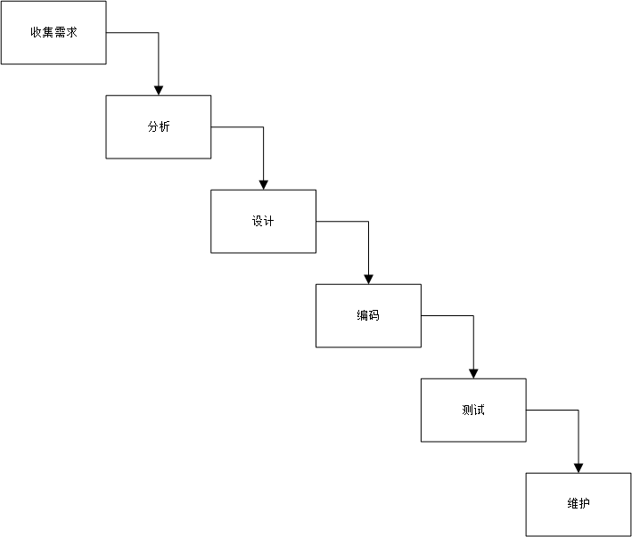
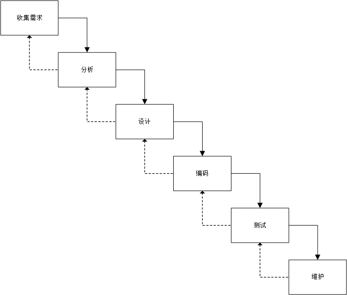
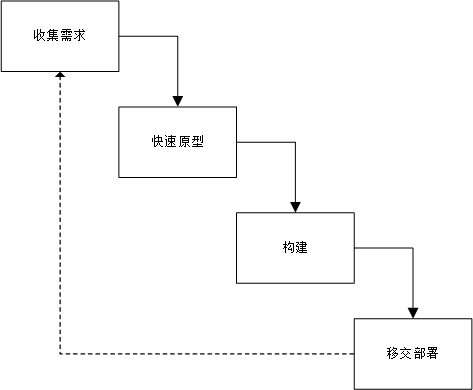
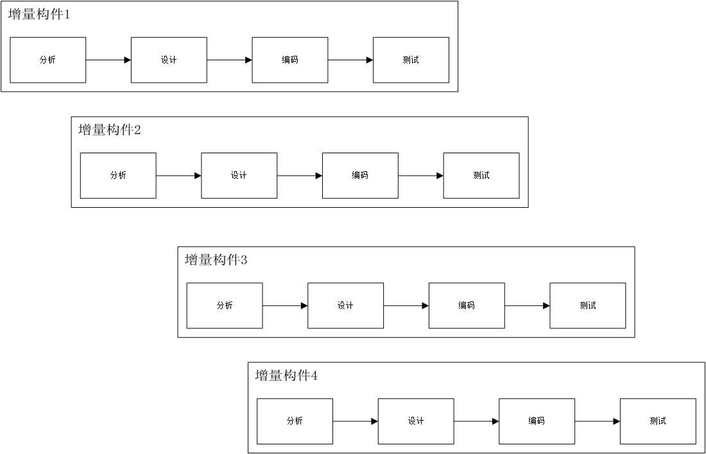
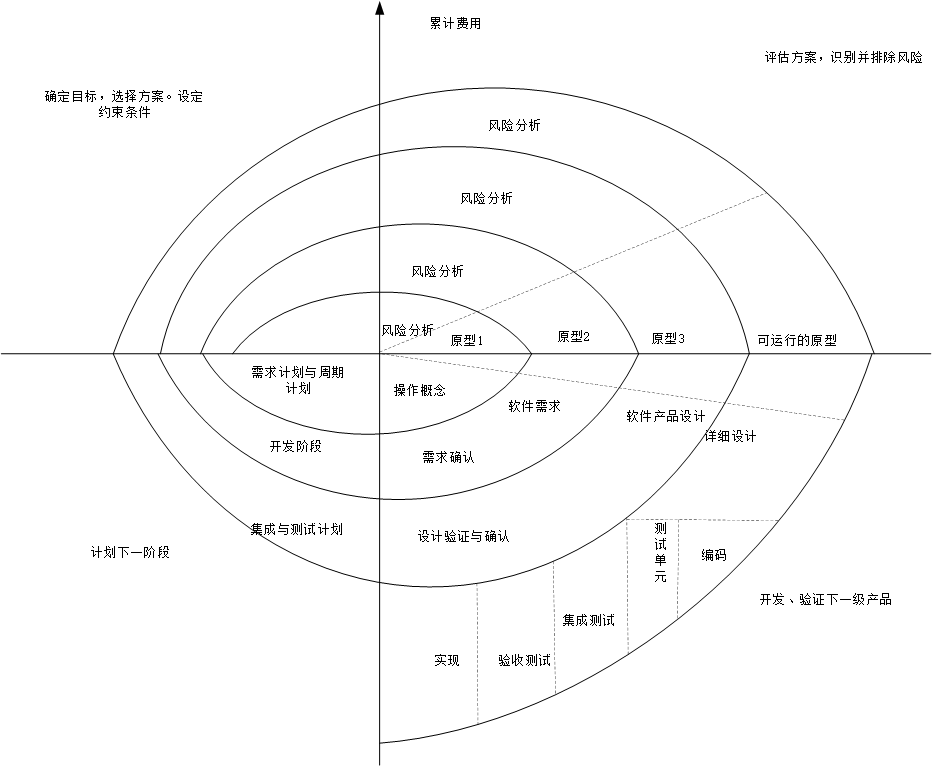
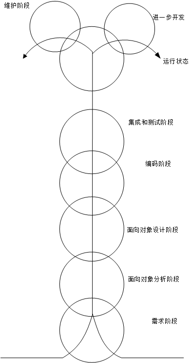

# 软件过程

## 软件生命周期

+ 软件定义的三个阶段：
    1. 问题定义：
        1. 要解决问题是什么
        2. 通过调研，系统分析员应该提出问题性质、工程目标和工程规模的书面报告
    2. 可行性研究：
        1. 解决上一个阶段的问题是否有行得通的解决方案（技术可行性）
        2. 用最小的代价再尽可能的短的时间内确定问题是否能够解决（经济可行性）
        3. 是否符合社会基本准则（社会可行性）
    3. 需求分析
        1. 解决“目标系统必须要做什么”这个问题可行性研究的基本目的是使用较小的成本再较短的时间内确定是否存在可行解
        2. 使用正式文档准确记录对目标系统的需求，该文档通常称为 *规格说明（specification）*
        3. 期望：功能需求（非约束的情况下），非功能需求（约束情况下）
+ 软件开发的四个阶段：
    1. 概要设计
        1. 概括地回答“怎样实现目标系统”，又称初步设计、逻辑设计、高层设计或总体设计
        2. 设计几种方案
        3. 推荐最佳方案
    2. 详细设计
        1. 将抽象概括的方法具体化
        2. 设计出程序的详细规格
        3. 详细地设计每个程序模块
        4. 也称模块设计、物理设计或低层设计
    3. 编码和单元测试
        1. 写出正确的、容易理解、容易维护的程序模块
        2. 把详细的设计的结果翻译成选定的语言书写成程序，并且详细测试编写出每一个模块
    4. 综合测试
        1. 这个阶段的关键任务是通过各种类型的测试（及相应的调试）使软件达到预定的要求

## 瀑布模型

+ 特点：
    1. 阶段间具有顺序性和依赖性
        1. 必须等前一阶段的工作完成之后，才能开始后一阶段的工作
        2. 前一阶段的输入文档是后一阶段的输入文档
    2. 推迟实现的观点
    3. 质量保证的观点
        1. 每个阶段都必须完成规定的文档
        2. 每个阶段结束前都要对所完成的文档进程评审
+ 优点：
    1. 可以强迫开发人员采用规范的方法
    2. 严格规定了每个阶段必须提交的文档
    3. 要求每个阶段交出的所有产品都必须经过质量保证小组的仔细验证
+ 缺点：**瀑布模型是由文档驱动的**
+ 传统的瀑布模型： 
+ 加入迭代过程的瀑布模型： 

## 快速原型模型

+ 优点：软件产品的开发基本上是按线性顺序进程的 

## 增量模型

+ 优点：
    1. 能在较短的时间内向用户提交可完成一些有用的工作的作品
    2. 逐步增加产品功能可以使用户有较充裕的事件学习和适应新产品
+ 困难：在把每个新的增量构建集成到现有的软件体系结构中时，必须不破坏原来已经开发出的产品
+ 增量模型： 

## 螺旋模型

+ 基本思想：使用原型及其他方法来尽量降低风险。可以看做在每个阶段之前都增加了风险分析过程的快速原型模型
+ 点画线的长度：当前累计的开发费用
+ 螺线旋过的角度：开发进度
+ 优点：
    1. 对可选方案和约束条件的强调有利于已有软件的重用
    2. 有助于把软件质量作为软件开发的一个重要目标
    3. 减少过多的测试（浪费资金）和测试不足（产品故障多）所带来的风险
    4. 模型中维护只是模型的另一个周期，在维护和开发之间并非没有本质区别
    5. 适用于内部开发的大规模软件项目
    6. 风险驱动
+ 螺旋模型： 

## 喷泉模型

+ 喷泉模型： 

## Rational统一过程

+ 6个 **最佳实践**：
    1. 迭代开发
    2. 管理需求
    3. 使用基于组件的架构
    4. 可视化建模
    5. 验证软件质量
    6. 控制软件变更
+ 10个 **要素**：
    1. 前景：定制前景
        1. 关键术语（词汇表）
        2. 尝试解决的问题（问题声明）
        3. 目干系人，用户，他们需要什么
        4. 产品特性
        5. 功能性需求
        6. 非功能性需求
        7. 设计约束
    2. 计划：按计划管理
    3. 风险：降低风险并跟踪相关问题
    4. 业务案例：检验业务案例
    5. 架构：设计组件架构
    6. 原型：增量地构建和测试产品
    7. 评估：定期评估结果
    8. 变更请求：管理并控制变更
    9. 用户支持：部署可用的产品
    10. 过程：采用适合项目的过程
