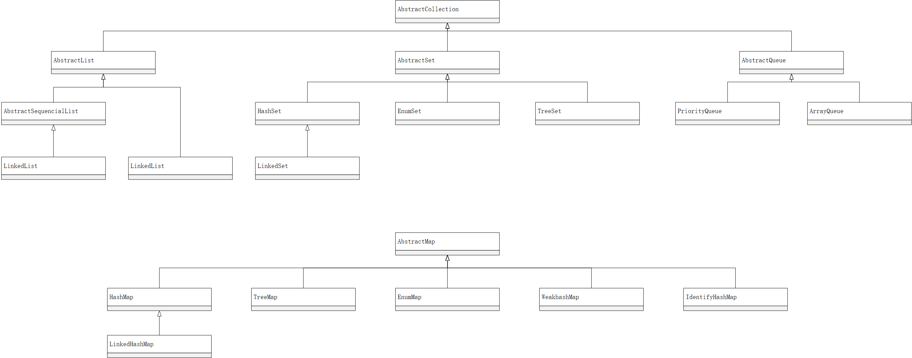

# 第九章 集合

+ 在Java库中，集合类的基本接口是Collection接口。这个接口有两个基本方法：
+ 标准类库中的任何集合都可以使用“`for each`”循环
+ 在Java8中，也可以不用写循环，调用`forEachRemaining`方法并提供一个lambda表达式（它会处理一个元素）。将对迭代器的每一个元素调用一个lambda表达式，直到再没有元素为止 `iterator.forEachRemaining(element -> do something with element);`

## Java集合框架

### 迭代器

+ Iterator接口包含了4个方法：

    ```java
    public interface Iterator<E> {
        E next();
        boolean hasNext();
        void remove();
        default void forEachRemaining(Consumer<? super E> action);
    }
    ```

+ 迭代器查找元素的唯一方法是调用next遍历
+ 可以将`Iterator.next`与`InputStream.read`看作为等效的
+ next方法和remove方法的调用具有互相依赖性。如果在调用remove之前没有调用next将是不合理的。如果这样做，将会抛出一个`IllegalStateException`异常
+ 如果想要删除两个相邻的元素需要先调用next越过将还要删除的元素。

    ```java
    it.remove();
    it.next();
    it.remove();
    ```

### 集合框架中的接口

+ 集合框架中的接口

+ 为了避免对链表完成随机访问操作，Java SE 1.4引入了一个标记接口`RandomAccess`。这个接口不包含任何方法，不过可以用它来测试一个特定的集合是否支持高效的随机访问：

    ```java
    if (c instanceof RandomAccess) {
        use random access algorithm
    }
    else {
        use sequential access algorithm
    }
    ```

+ Set接口等同于Collection接口，但是Set的`add`方法不允许增加重复元素

### 具体的集合

+ 除了以Map结尾的类之外，其他类都实现了Collection接口，以Map结尾的类实现了Map接口
+ 集合框架中的类

+ LinkedList是一个双向链表
+ add方法只依赖于迭代器的位置，而remove方法依赖于迭代器的状态
+ 如果迭代器发现它的集合被另一个迭代器修改了，或者是该集合自身的方法修改，就会抛出一个`ConcurrentModificationException`异常。如：

    ```java
    List<String> list = ...;
    ListIterator<String> iter1 = list.listIterator();
    ListIterator<string> iter2 = list.listIterator();
    iter1.next();
    iter1.remove();
    iter2.next(); // throws ConcurrentModificationException
    ```

+ LinkedList类提供了一个用来访问某个特定元素的`get`方法：

    ```java
    LinkedList<String> list = ...;
    String obj = list.get(n);
    ```

    这种方法的效率并不高，不要使用下面的代码：

    ```java
    for (int i = 0; i < list.size(); i++)
        /*do something with */list.get(i);
    ```

    这种效率极其低下
+ 使用链表的唯一原因，是尽量减少在列表中插入或删除元素所付出的代价

### 散列集

+ 在Java中散列表用链数组实现，每个列表被称为 **桶（bucket）**
+ 在Java SE 8中，桶装满时会从链表变成平衡二叉树
+ 如果想要更多地控制散列表的运行性能，就要指定一个初始的桶数。通常，将桶数设置为 *预计元素个数的75%~150%*，最好将桶数设置为一个素数，以防键的聚集
+ 如果散列表太满，就需要 **再散列（rehashed）** ，此时需要创建一个桶数更多的表，将所有元素装进新的散列表中
+ **装填因子** 决定何时对散列表进行再散列，一般设置为 **75%（或0.75）**
+ HashSet类，实现了基于散列表的集，散列集迭代器依次访问所有的桶。只有 **不关心集合中元素的顺序时** 此应该使用HashSet

### 树集

+ 树集和散列集十分相似，树集是有序集合，可以以任何顺序将元素插入到树集中，在对集合进行遍历时，每个值将自动的按照排序后的顺序呈现
+ 排序是用树完成的（当前使用的是红黑树）
+ 要使用树集，必须是能够比较的元素，这些元素必须实现Comparable接口，或者构造集时，必须提供一个Comparator

### 队列和双端队列

+ 接口为`Deque`，由`ArrayDeque`和`LinkedList`类实现

### 优先队列

+ 优先级队列中的元素可以按照任意的顺序插人，却总是按照排序的顺序进行检索。
+ 无论何时调用`remove`方法，总会获得当前优先级队列中 *最小的元素*
+ 使用堆实现

## 映射

### 基本映射操作

+ Java类库为映射提供了两个通用的实现：`hashMap`和`TreeMap`
+ 散列或比较函数 **只能** 作用于 **键**，也就是说，“散列”和“树”都是作用与键上
+ 要迭代处理映射的键和值，最容易的方法是使用forEach方法。可以提供一个接受 *键和值的lambda表达式* 。映射中的每一项依顺序调用这个表达式：`scores.forEach((k, v) -> System.out.println("key = " + k + ", value = " + value);)`

### 更新映射项

+ 如，看到一个单词（word）时，将计数器增1：`counts.put(word, counts.get(word) + 1)`，这是可以的</br>但是一种情况除外：当第一次看到word时，get会返回null，因此会出现一个`NullPointerException`异常，此时可以使用`getOrDefault`方法：`counts.put(word, counts.getOrDefault(word, 0) + 1)`</br>另一种方法是，首先调用`putIfAbsent`方法。只有当键原先存在时才会放入一个值

    ```java
    counts.putIfAbsent(word, 0);
    counts.put(word, counts.get(word) + 1);
    ```

+ 更好的做法是，使用`merge`方法简化操作，如果键原先不存在，下面调用：`counts.merge(word, 1, Integer::sum);`

### 映射视图

+ 三种视图：键集合、值集合（不是一个集）、键值对集
+ 键和键值对可以构成一个集合
+ 映射中一个键只有能有一个副本

    ```java
    Set<K> keySet();//键集
    Collection<K> values();//值集
    Set<Map, Entry<K, V>> entrySet();//键、键值对集合
    ```

+ 访问所有条目的最高效方法（`forEach`）：`counts.forEach((k, v) -> { do something with k, v});`

### 弱散列映射

+ `WeakHashMap`使用 **弱引用（weak references）** 保存键，如果某个对象只能由`WeakReferences`引用，垃圾回收器将进行回收，但要将引用这个对象的弱引用放入队列中

### 链接散列集和映射

+ `LinkedHashSet`和`LinkedHashMap`类用来 **记住插入元素的顺序**，当条目插入到表中时，就会并入双向链表中
+ 链接散列映射将用 **访问顺序**，而不是插入顺序，对映射条目进行迭代
+ 每次调用`get`或`put`, 受到影响的条目将 **从当前的位置删除**， 并 **放到条目链表的尾部**（只有条目在链表中的位置会受影响，而散列表中的桶不会受影响。一个条目总位于与键散列码对应的桶中）
+ 要构造散列映射表，需要调用：`LinkedHashMap<k, v>(initialCapacity, loadFactor, true)`

### 枚举集和映射

+ `EnumSet`类没有公共的构造器，而是使用静态工厂方法进行构造：

    ```java
    enum Weekday { MONDAY, TUESDAY, WEDNESDAY, THURSDAY, FRIDAY, SATURDAY, SUNDAY };
    EnumSet<Weekday> always = EnumSet.allOf(Weekday.class);
    EnumSet<Weekday> never = EnumSet.noneOf(Weekday.class);
    EnumSet<Weekday> workday = EnumSet.range(Weekday.MONDAY,Weekday.FRIDAY);
    EnumSet<Weekday> mwf = EnumSet.of(Weekday.MONDAY, Weekday.WEDNESDAY, Weekday.FRIDAY);
    ```

+ 可以使用Set接口的方法类修改EnumSet
+ EnumMap是一个 **键类型为枚举类型** 的映射，在使用时，需要在构造器中指定键类型：`EnumMap<Weekday, Employee> personInCharge new EnumMap<>(Weekday.class)`

### 标识散列映射

+ 在`IdentityHashMap`类中，键的散列值不是用hashCode函数计算的，而是用`System.identityHashCode`方法计算的
+ 在对两个对象进行比较时，IdentityHashMap类使用 **==**，而不使用equals

## 视图与包装器

+ keySet方法返回一个实现Set接口的类对象，这个类对原映射进行操作，这种集合称之为 **视图**

### 轻量级集合包装器

+ `Collections.nCopies(n, anObject)`将返回一个实现List接口的不可修改的对象
+ `Collections.singleton(anObject)`将返回一个视图对象，这个对象实现了Set接口，返回的对象实现了一个不可修改的单元素集
+ 类似地，对于集合框架中的每一个接口，还有一些方法可以生成空集、 列表、 映射，等等
+ 特别是， 集的类型可以推导得出：`Set<String> deepThoughts = Collections.emptySet()`

## 不可修改的视图

+ 可以使用下面8个方法获得不可修改视图：
    1. `Collections.unmodifiableCollection`
    2. `Collections.unmodifiableList`
    3. `Collections.unmodifiableSet`
    4. `Collections.unmodifiableSortedSet`
    5. `Collections.unmodifiableNavigateSet`
    6. `Collections.unmodifiableMap`
    7. `Collections.unmodifiableSortedMap`
    8. `Collections.unmodifiableNavigateMap`
+ 这些视图对现有集合增加了一个运行时的检查，如果试图对集合进行修改，就 **抛出一个异常**，同时这个集合 **仍然保持未修改状态**
+ 所有的更改器方法（例如， add) 已经被重新定义为抛出一个`UnsupportedOperationException`异常，**而不是将调用传递给底层集合**
+ Collections.unmodifiableCollection方法的equals方法不调用底层集合的equals方法，而是继承了Object类的equals，**只会比较两个对象是否是同一个对象
+ Collections.unmodifiableSet方法和Collections.unmodifiableMap方法，使用底层集合的equals方法和hashCode方法

### 受查视图

+ 用来对泛型类型发生问题时提供调试支持

## 算法

### 集合与数组的转换

+ 数组转化为集合：

    ```java
    String[] values;
    HashSet<String> staff = new HashSet(ArrayList.asList(values));
    ```

+ 集合转化为数组：`Object[] values = staff.toArray();`，这样得到的是一个对象数组，toArray返回的是一个`Object[]`
